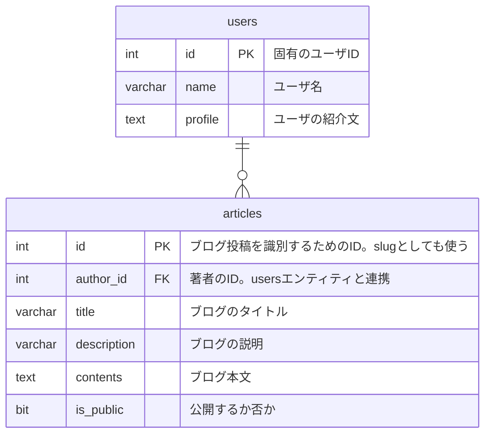

## はじめに

なぜER図を描こうと思ったかと言うと、インターンの選考テストでSQLについての知識が問われたことがきっかけである。

テスト受験直前まで知識ゼロだったのだが、試験中に勉強している間にSQLでデータベースを操作できることに何気ない感動を覚えたし、データベース設計に興味が湧いてきた（受験中にブラウザ等で調べものが出来るルールだった）。

データベース設計の基本と言えばER図だと思っているので入門してみたまでである。

ついでにずっと気になっていたMermaid記法もついでに習得してやろう、ということでMermaidでER図を作成できるまでをゴールとしたい。

## そもそもデータベース知識

早速ER図の作り方を調べていたのだが、データベースに対してあまりにも無知だったので、気になったところのメモを残しておく。

### レコードとは

**データベースの1件当たりのデータ単位**のこと。行列で例える時、データベースのカラム（各プロパティ）が列なら、レコードは行。

### PK, UKの違い

それぞれ主キー制約(Primary Key), 一意キー制約(Unique Key)である。

主キー制約は**とにかくレコードを識別するため**に設ける。そのためNull値を許容しない、NOT NULL制約がかけられている。

また名前の通り、**一つのカラムに対してのみ設定できる**。

よくあるのが例えば、ユーザデータの内、ユーザIDは一意であるために主キー制約を設けることで、1人のユーザを特定できる。

対して一意キー制約では各カラムの組み合わせがユニークであれば良いという仕組み。

そのため、**PKはUKの中の親分**のようにとらえることも出来そうだが、**PKと違うところはNull値を許容する**こと。

そのため、複数のレコードで対象のカラムがNull値でも重複判定はされない。

以下のページが参考になった。

- [一意制約（ユニーク制約 / UNIQUE制約）とは - 意味をわかりやすく - IT用語辞典 e-Words](https://e-words.jp/w/%E4%B8%80%E6%84%8F%E5%88%B6%E7%B4%84.html)
- [主キーとユニークキーの違いとは？分かりやすく解説! | トーマスイッチ (toumaswitch.com)](https://toumaswitch.com/lhyptrfz6o/)
- [一意性制約（UNIQUE KEY)と主キー制約 (PRIMARY KEY)は違う #初心者 - Qiita](https://qiita.com/hyougo-suga/items/9ce65df7e2e602d4f24b)

## ER図入門

ではER図ってなんぞやを学んでいく！

ER図は”Entity Relationship Diagram”と訳され、「エンティティ同士の関係図」ということになる。

エンティティとはデータベースのテーブルのことであり、各テーブルの連携をER図で表現できるみたい。

そもそもの目的としてはデータ構造をハッキリさせることで、設計をしやすくすること。

また、ER図にも種類があり、

- 概念ER図
- 論理ER図
- 物理ER図

がある。

今回主に扱うのは物理ER図である。

ER図にはそれぞれ以下の要素で構成されている。

- エンティティ
    - 直訳「モノ」。テーブルのこと
- アトリビュート
    - エンティティの中のカラムのこと
- リレーション
    - テーブルをつなぐ線
- カーディナリティ
    - 直訳「多重度」
    - リレーションの始点・終点に付いており、エンティティ同士の要素数の比率などを表す
    - e.g. 1対1, 1対多数, 1対0か多数など

[https://web-img.rensa.jp.net/rensa/images/techmania/thumbnail/images/er1.png](https://web-img.rensa.jp.net/rensa/images/techmania/thumbnail/images/er1.png) より

### アトリビュートを構成する要素

アトリビュートは以下の内容から成り立っています。

- データ型
    - e.g. INT, CHARなど
- カラム名
    - まんまカラムの名前
    - e.g. id, name, ageなど
- キー
    - 先ほど説明したPK, UKに加えて外部キー FK(Foreign Key)を指定する
    - 参考: [ER図を簡単に作成してみよう【DB設計】【Mermaid】 (zenn.dev)](https://zenn.dev/seiya0/articles/tech-mermaid-erd#er%E5%9B%B3%EF%BC%88entity-relationship-diagram%EF%BC%89%E3%81%A8%E3%81%AF)のMermaid記述法 → PK, FK, UKとは
- 備考
    - 補足コメントを入れられる
    - e.g. “`age`の上限は120”, “田中さんはブラックリストね”など

おそらく順不同だが、私はこの順番に従うことにする。

### 参考

以下のページを参考にしました。

- [ER図とは？書き方をサンプルコードでわかりやすく解説 │ TechMania](https://techmania.jp/blog/er-diagram/)
- [ER図とは？基本ルールから書き方まで徹底解説！ (data-viz-lab.com)](https://data-viz-lab.com/er-diagram)
- [ER図を簡単に作成してみよう【DB設計】【Mermaid】 (zenn.dev)](https://zenn.dev/seiya0/articles/tech-mermaid-erd#er%E5%9B%B3%EF%BC%88entity-relationship-diagram%EF%BC%89%E3%81%A8%E3%81%AF)

## MermaidでER図

座学はここで終了。実際にER図を作成してみる。

まず言葉でデータベースの設計を行ってみる。

### 文章でデータベース構造定義

以下2つのエンティティを定義した。

- エンティティ名: users
    - 各カラム
        - int id PK “固有のユーザID”
        - varchar name “ユーザ名”
        - text profile “ユーザの紹介文”
- エンティティ名: articles
    - usersエンティティと連携
    - 1ユーザ当たり投稿数は0でもいいし、複数あっても良い
    - 各カラム
        - int id PK “ブログ投稿を識別するためのID。slugとしても使う”
        - int author_id FK “著者のID。usersエンティティと連携”
        - varchar title “ブログのタイトル”
        - varchar description “ブログの説明”
        - text contents “ブログ本文”
        - bit is_public “公開するか否か”

ここで使えるデータ型が何なのか詰まったので[SQLのデータ型まとめ #SQL - Qiita](https://qiita.com/shuhoyo/items/07d28cec6babe788051d)を参考とした。

### Mermaidで書いてみる

それではこれをER図に起こしてみる。

わーおい！ER図ええなあーーー⁉

箇条書きでも十分見やすかったけど、ER図のほうが見やすいでんな（もちろん慣れは必要やけど基本データベース設計している人は知ってる人たちやから関係ない気がする）。

感動ポイントを1つ挙げると、カーディナリティの記法が表現そっくりなこと。

これやったらいちいちカーディナリティを覚えなくても直感的に書けるから素敵やな。

### 参考

- [SQLのデータ型まとめ #SQL - Qiita](https://qiita.com/shuhoyo/items/07d28cec6babe788051d)

## まとめ

最初はカーディナリティが面倒くさそうに見えたけど、実際に触ってみたらそこまで難しくなかったし、もうちょっと早くMermaid記法に触れておけばよかった。。

ぶっちゃけデータベースを触らない人だったから勉強する意味が無かったんやけど、近頃の開発でデータベースを使うのでいい勉強になった。

素人でもちょっとの説明でデータベース構造が手に取れるのが良いところだと思った。

Mermaidが一番アツかった時期（たしかリリースされた2022年ごろ）から少し経っているおかげで主要ドキュメントツールはほとんどMermaid対応しているところもいいね。

個人的に使いたいMermaid記法についてもまとめたいけど、趣旨が変わるのでまた別記事で。

それでは👋
