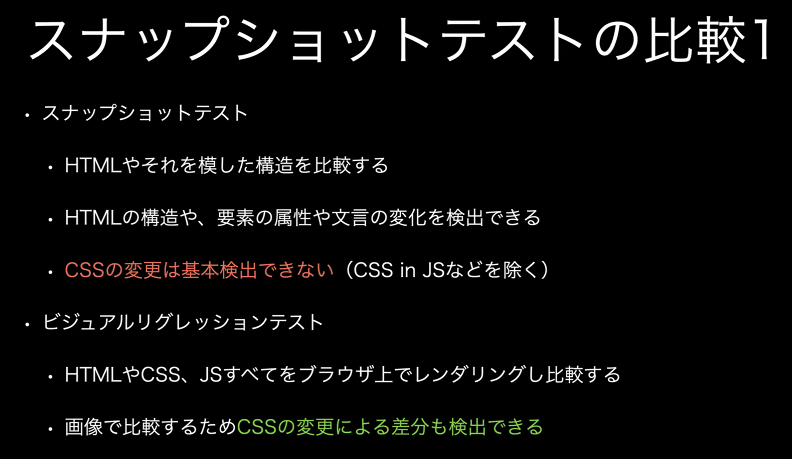

範囲と目的別にテストの種類がある。

## 静的解析
コードを実行せずに文字列として解析できる。
型システムも当てはまる。
TypeScript(tsc)

他にはリンタやフォーマッタなど
- リンタ: コーディングルールを脱していないか
- フォーマッタ: コーディング

単体テスト
関数やコンポーネント単体を対象とするテスト

実装、実行共に低コストでとっつきやすい
Jestなど

結合テスト
複数の関数・コンポーネントを組み合わせた場合のテスト
外部APIなどのシステム外に依存するものがある場合、モックを使うことが多い

E2Eテスト
本番システムやこれを模した環境で行う包括的なモノ
モックは基本的に使用しない
実装・実行コストが高くて、通信が増えるため不安定になりがちである。

インタラクションテスト
UIに対して特定のアクションを実行する。
e.g. ボタンクリック、フォームへの入力
単体・結合手薄とレベルではJest + React Test Library
E2EテストレベルではPlaywrightを使う。

アクセシビリティテスト
アクセシビリティの要件を満たすかを判定する。
確認項目は様々だが、デジタル庁のガイドラインが参考になる。

Axe: 様々なツールと連携可能
読み上げツール: MacのVoiceOver

スナップショットテスト
前回のテストと値が一致することを保証するテスト。

フロントエンドでは、コンポーネントをHTML、またはオブジェクトや文字列で出力し、これを比較することが多い。
インタラクションテストと組み合わせられる。

UIコンポーネントエクスプローラー
コンポーネントやページを一覧するツールまたは手法のこと。
有名なライブラリにStorybookがある。こいつはインタラクションテストを統合していたりする。

ロジックについてはおおよそテストが可能。しかし、UIについてはどうだろうか？
CSSによるスタイリングの変化は検出が難しい
→ グローバル変数などはどうしたらいいんだ！！

## ビジュアルリグレッションテスト
以降VRT
画像の比較を行い差分を検出する。

### スナップショットテストとの比較

スクリーンショットを自動で撮ってくれるのはありがたい

## Playwright
E2Eテスティングフレームワーク
ブラウザをコードベースで操作できる
→ ボタンクリック、スクロール、開発者ツールの操作⁉など
JSだけでなく、Pythonなどでも実装可能。
対応ブラウザも多く、デバイスのプリセット（スマホとして検証する、など）も豊富！
